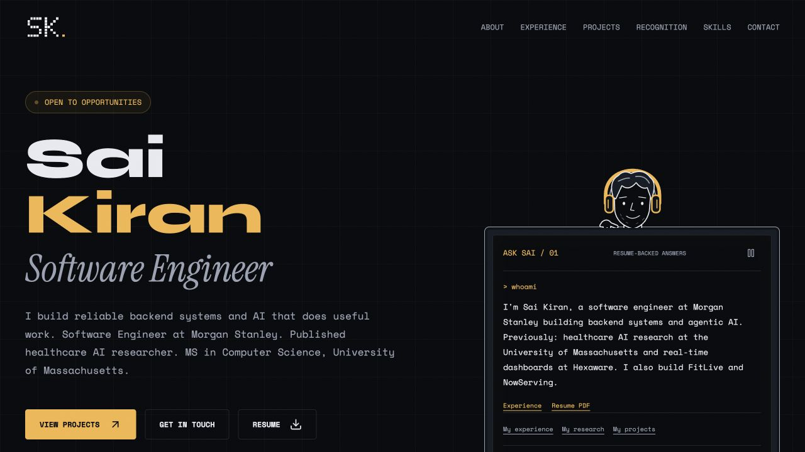

# Minimalistic Portfolio

My personal portfolio: backend engineering, applied AI research, and products I've built beyond the demo.

**[Visit the portfolio](https://kirann05.github.io/sai-kiran-portfolio/)**



## Why I built it

I wanted someone reviewing my work to find the important things quickly: what I worked on, the decisions behind my projects, and evidence they can explore. The design adds personality without making the content harder to read.

## My approach

- Put experience, projects, research, and the resume one click away.
- Write project notes around behavior and engineering decisions, not just stacks.
- Keep the palette quiet, with amber accents and a custom pixel SK identity.
- Make motion follow the reader: reversible reveals, no scroll hijacking.
- Turn the introduction into a useful, interactive monitor rather than a decorative widget.

## For recruiters

- Work at Morgan Stanley and Hexaware, with outcomes and technologies.
- Healthcare AI research linked to the EMNLP paper and discussion.
- FitLive and NowServing case studies, including an in-page walkthrough.
- A live bakery preview, public repositories, and role-based filtering.
- A relevant screenshot or architecture diagram for every project.
- Ask Sai: short career answers with supporting links.
- A downloadable resume and direct contact options.

Ask Sai is a local, curated guide, not generative AI. It keeps the current topic for follow-ups, admits when it has no answer, and does not send or store questions. The goal is easier access to evidence, not a promised ATS score or hiring outcome.

## Built with

- HTML, CSS, and vanilla JavaScript; no framework or build step.
- Native dialogs, IntersectionObserver, and requestAnimationFrame.
- Original SVG character artwork and a one-shot pixel GIF.
- Lucide icons; Syne, Space Mono, and Instrument Serif from Google Fonts.
- GitHub's public API, a checked-in fallback, and a one-hour cache.
- GitHub Pages for hosting; Node's built-in assertions for tests.

## Lessons from the build

- Small details matter: focus return, Escape, and useful empty states.
- Animation needs a purpose, an off switch, and a stable layout.
- Reliable fallbacks matter when third-party services are unavailable.
- Keeping content separate makes updates easier.
- Source-backed answers are more useful than invented interview responses.

## Run locally

```sh
python3 -m http.server 8766
```

Open http://localhost:8766. Run `npm test` with Node installed; no package install is needed.

## Make changes

- `data.js`: biography, experience, project notes, skills, and links.
- `project-evidence.js`: current profile facts, renamed repository links, role tracks, and source-backed case-study notes.
- `scripts/build-project-diagrams.cjs`: generates the original architecture visuals from the project evidence.
- `app.js`: navigation, filters, dialogs, GitHub data, and scroll effects.
- `hero-coder.js` and `hero-coder.css`: character, monitor, and resume guide.
- `styles.css`: typography, colors, and responsive layouts.
- `assets/`: resume, project visuals, logo, and homepage screenshot.
- `tests/`: focused checks for filtering, safety, content, and guide behavior.

Pages serves the root of `main`. Push a commit to publish an update. Fonts, GitHub data, YouTube, and the bakery preview depend on third-party availability; local project notes remain available if those services fail.

## Checks and accessibility

Keyboard navigation, labelled controls, focus management, and reduced-motion fallbacks are included. Desktop/mobile checks and focused tests passed. Full screen-reader testing, cross-browser certification, and Lighthouse scores are not claimed.

## Credits

Early typography and layout inspiration came from [Santosh Yadav's portfolio](https://santoshyadav.vercel.app/), with the restrained direction informed by Polsia. The implementation, pixel mark, and character were made for this portfolio. Lucide retains its bundled license notice. Project media and resume content belong to their respective authors.
